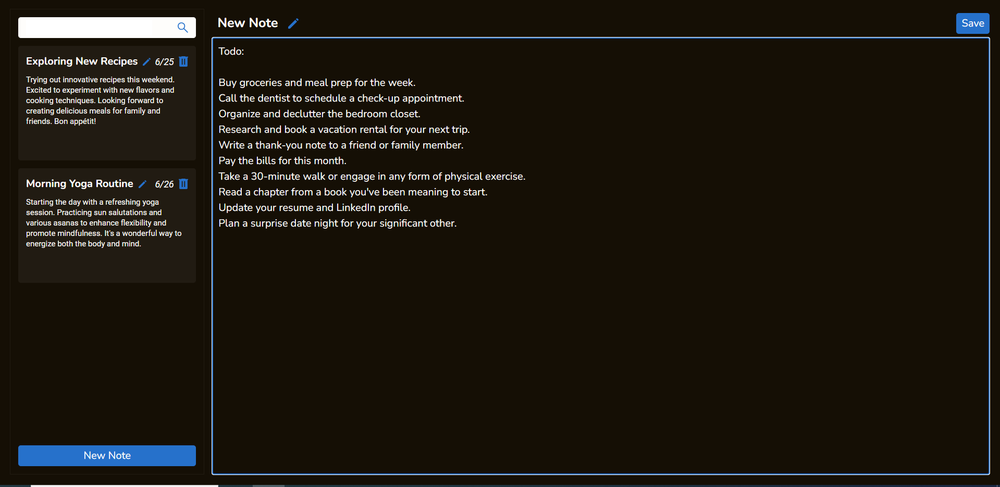

# Note Taking App

This is a simple note-taking app built with React. It allows users to create, edit, and save notes in a user-friendly interface.

## Features

- Create new notes with a default title and empty body
- Edit the title and body of existing notes
- Save notes to persist the changes
- Delete notes that are no longer needed
- Search functionality to filter notes based on title and body content

## Technologies Used

- React: JavaScript library for building user interfaces
- Tailwind CSS: Utility-first CSS framework
- Context API: State management for sharing data across components
- TypeScript: Typed superset of JavaScript
